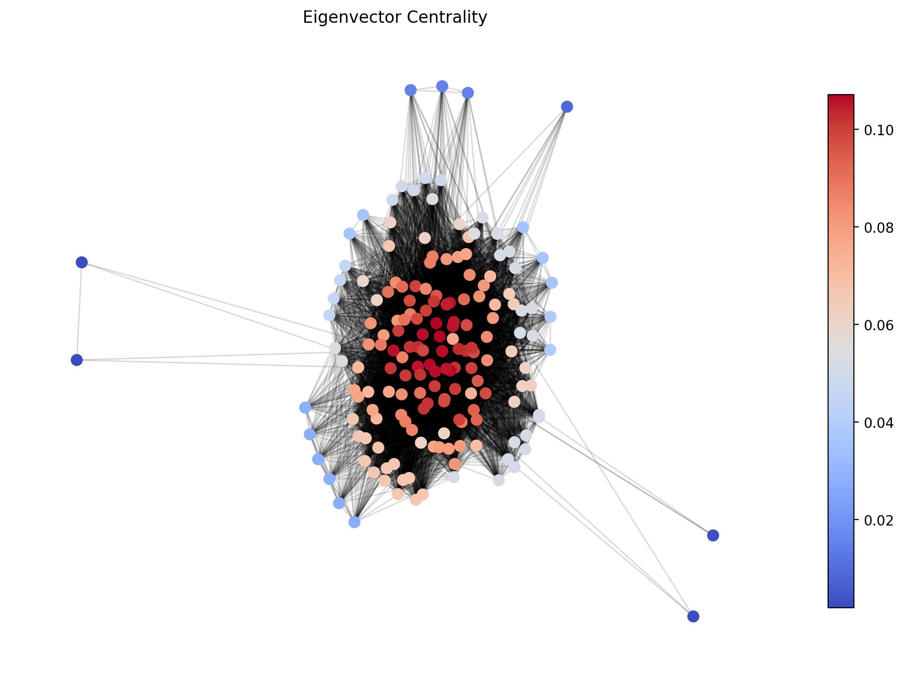
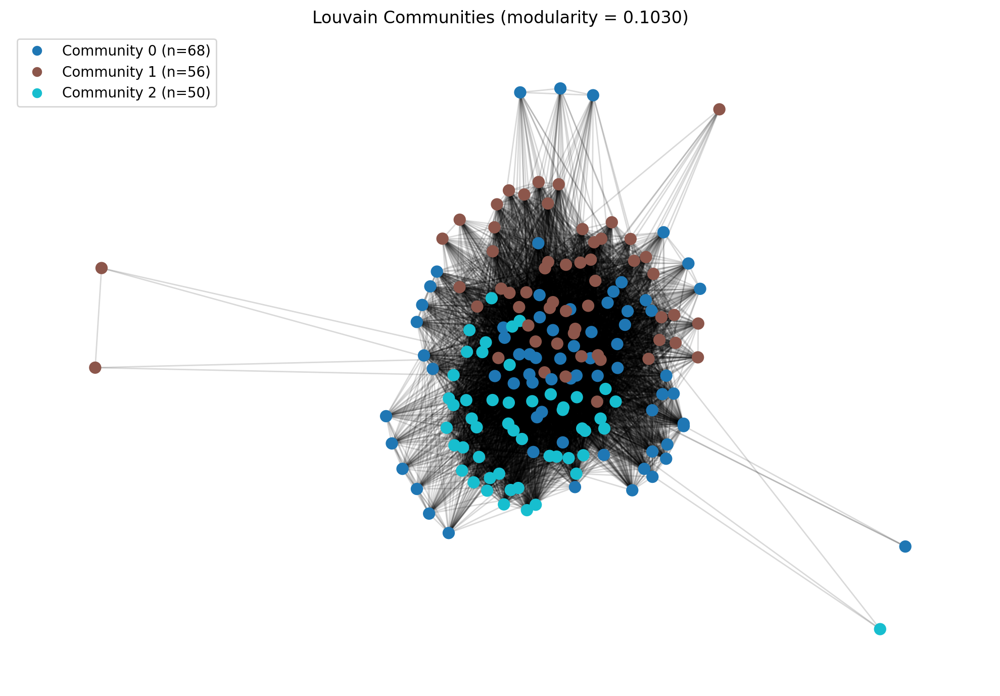
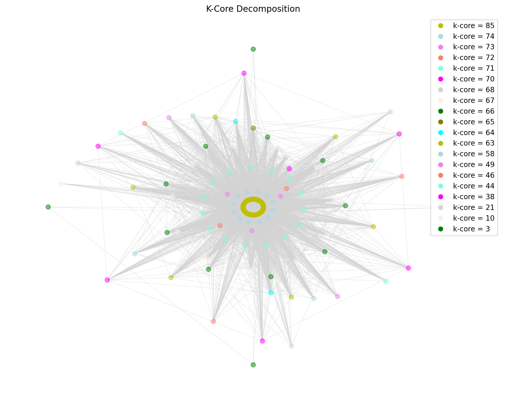

# Social Network Community Detection

Analyzing how academic behaviors spread through a university course's online community using network science and complex contagion models.

## Overview

This project constructs a knowledge graph from anonymized Discord interaction data for an undergraduate CS course, projects it into a user-user social network, and applies centrality analysis, community detection, and contagion simulation to identify optimal strategies for maximizing behavior adoption (e.g., writing tests before coding, peer code review).

## Key Findings

- The network exhibits a **core-periphery structure** rather than well-separated communities (density = 0.578, clustering coefficient = 0.853)
- A small number of TAs and highly active students dominate centrality rankings across degree, eigenvector centrality, and PageRank
- Under **absolute threshold** contagion, 5 well-placed seeds achieve ~98% adoption in 2 steps
- Under **fractional threshold** contagion, a critical transition at $\theta \approx 0.10\text{--}0.15$ separates full cascade from failure
- **Mixed TA-student seeding** (2 TAs + 3 students) outperforms single-role strategies across all configurations

## Methods

| Technique | Purpose |
|---|---|
| One-mode projection | Collapse bipartite knowledge graph into user-user network |
| Eigenvector centrality, PageRank, degree | Identify influential nodes |
| Louvain, Newman hill-climbing, spectral, normalized Laplacian | Community detection |
| K-core decomposition | Characterize core-periphery structure |
| Synchronous threshold contagion | Simulate behavior spread with absolute and fractional models |

## Project Structure

```
├── data/                  # Graph data and simulation outputs
├── notebooks/
│   ├── data_exploration.ipynb
│   ├── mode_projection.ipynb
│   └── graph_analysis.ipynb
├── src/
│   ├── partitioning_utils.py    # Newman, spectral, Laplacian community detection
│   ├── drawing_utils.py         # K-core visualization
│   └── dendrogram_handler_v2.py
├── report/
│   └── main.tex                 # Full writeup (LaTeX)
└── figs/                  # Network visualizations
```

## Setup

Requires Python 3.13+. Install dependencies with [uv](https://docs.astral.sh/uv/):

```bash
uv sync
```

Or with pip:

```bash
pip install networkx pandas matplotlib scikit-learn jupyter
```

## Sample Visualizations

| Eigenvector Centrality | Louvain Communities | K-Core Decomposition |
|---|---|---|
|  |  |  |
