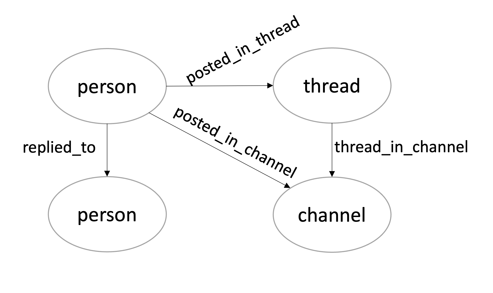

# Modeling Complex Contagion in a Discord Community Using Knowledge Graphs

---

## Objective

This project explores how new behaviors spread through social interactions in an online community. Using a dataset of anonymized interactions from a Discord server, students will construct a knowledge graph, analyze network structures, and simulate the spread of behaviors based on complex contagion theory. The desired learning outcome is to apply knowledge graphs, node metrics, and community detection algorithms to real world data in a problem that has a feasible connection to the real world.

## Problem Statement

A teacher wants to encourage students in an undergraduate CS course to adopt new behaviors that may improve their success, such as:

- Writing useful tests before programming.
- Reading assigned material before class.
- Completing homework in small groups.
- Reviewing each other's code.
- Using LLMs as tutors and for busy work (but not as vicarious programmers).
  Adoption of these behaviors depends on social cues and reinforcement, making it compatible with the complex contagion models you explored in Project 2.

## Dataset Overview

The dataset consists of two CSV files:

- nodes.csv: Defines entities in the Discord server, including students, TAs, channels, and threads.
- edges.csv: Defines interactions between nodes, including replies, thread participation, and message authorship.
  Edges represent social interactions that facilitate behavior adoption. See the description of the contents of the two files in this slide deck.

## Tasks and Methodology

### 1. Load the Knowledge Graph

- The dataset and graph is described in these slides
- The knowledge graph is found in the class repo under notebooks/graph_data_science/project_3_graph.graphml
- Read the graph into a networkx graph structure using `G = nx.read_graphml("project_3_graph.graphml")`

### 2. Understand the graph schema

Each node in the graph has the following attributes:

- a vertex number used to reference it in the graph
- the ID used in nodes.csv and edges.csv
- what kind of node it is
- person
- thread
- channel
- the node value, which for a person is
- TA
- Student
- Instructor

### 3. Apply one-mode projection to create a user-user interaction network based on shared threads, replies, and channels.

### 4. Identify Key Nodes

- Compute degree, eigenvector centrality, and PageRank to identify influential users.
- Determine which TAs and students are most important for enabling the spread of complex contagion.
- Use community detection algorithms (e.g., Louvain clustering, spectral clustering methods) to find natural groupings of students.

### 5. Simulate Complex Contagion

- Choose early adopters based on centrality, node metrics, and community structure.
- Model the spread of behaviors using the fractional threshold complex contagion model where a percentage of a nodes neighbors must adopt before the agent will adopt.
- Evaluate the spread based on different seeding strategies (e.g., high-degree nodes, community bridges).

### 6. Optimize Behavior Adoption

- Determine how interventions (e.g., assigning key TAs to influence key students) affect adoption rates.
- Explore methods for maximizing behavior spread while minimizing intervention efforts.

## Deliverables

1. Network Analysis Report: Findings on influential nodes, communities, and network structure.

2. Simulation Results: Comparison of different early adopter strategies and their effects.

3. Recommendations: Strategies for maximizing behavior adoption based on the results.

## Tools and Libraries

- Python (pandas, NetworkX, matplotlib, scikit-learn)

- The simulation code you used in Project 3

## Assessment Criteria

Correctness:

- Proper knowledge graph construction and analysis.
- Proper application of network analysis metrics and tools.
- Proper application of graph representations and operations (e.g., biadjacency matrices, one-mode projection)
  Insightfulness:
- Meaningful interpretations of network structure and influence.
- Meaningful identification of important nodes and community structures
  Creativity:
- Interesting and justified strategies for optimizing behavior adoption.

## Grading Rubric

### Correctness (40 points)

#### Knowledge Graph Construction (15 points)

- 10 points: Properly constructs a knowledge graph with students, TAs, threads, and channels as nodes, and appropriate interactions as edges.
- 5 points: Correctly applies one-mode projection to construct a user-user interaction network.
  Network Analysis (15 points)
- 5 points: Applies degree, eigenvector centrality, PageRank correctly, and other network metrics correctly.
- 5 points: Identifies key students and TAs who influence behavior spread.
- 5 points: Applies community detection methods (Louvain, spectral clustering) appropriately.

#### Simulation and Modeling (10 points)

- 5 points: Implements a fractional threshold complex contagion model correctly.
- 5 points: Evaluates different early adopter strategies using appropriate metrics.

### Insightfulness (30 points)

#### Network Interpretation (15 points)

- 5 points: Provides meaningful insights into network structure and influential nodes.
- 5 points: Analyzes the role of TAs and students in enabling behavior spread.
- 5 points: Explains community structures and their relevance to behavior adoption.

#### Simulation Analysis (15 points)

- 5 points: Interprets the spread of behaviors in the simulation effectively.
- 5 points: Evaluates the impact of different early adopter selection strategies.
- 5 points: Assesses intervention strategies and their effectiveness in maximizing behavior adoption.

### Justification of Tools and Interventions (20 points)

#### Use of Network Metrics (10 points)

- 5 points: Justifies the selection of centrality measures and community detection techniques based on network characteristics.
- 5 points: Demonstrates an understanding of how these metrics inform decision-making for behavior adoption.

#### Intervention Strategy (10 points)

- 5 points: Clearly explains and justifies the choice of early adopters and intervention strategies.
- 5 points: Supports intervention decisions with data-driven evidence from network analysis and contagion modeling.

### Presentation and Clarity (10 points)

#### Report Structure and Organization (5 points)

- 3 points: Logical flow of findings and explanations.
- 2 points: Proper use of figures and tables for visualization.

#### Clarity of Justifications (5 points)

- 3 points: Clearly explains methodology and rationale for decisions.
- 2 points: Uses appropriate terminology and reasoning when discussing network concepts.

Total: 100 points
